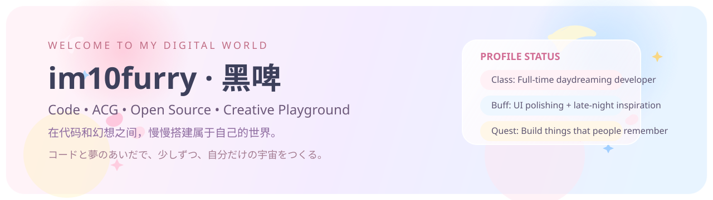

# 
欢迎来到 `im10furry · 黑啤` 的小宇宙

  

  
  
  

> 「把灵感写进代码，把喜欢的东西做成作品。」

  GitHub 上是 <code>im10furry</code>，中文是 <code>黑啤</code>。

## 🌸 关于我

| 属性 | 内容 |
| --- | --- |
| `ID` | `im10furry` |
| `中文别称` | `黑啤` |
| `职业设定` | 二次元开发者 |
| `当前状态` | 一边写代码，一边给自己的仓库添油加醋 |

## ✨ 当前任务栏

- 👯 想一起合作：`开源项目、创意页面、小工具、ACG 向内容`
- 💬 可以来聊：`技术、Furry、二次元文化`

## 🪄 技能树

  
  
  
  
  
  
  
  
  
  

## 📊 角色面板

  
  

  

## 🎐 联系方式

| 平台 | 账号 |
| --- | --- |
| `GitHub` | [@im10furry](https://github.com/im10furry) |
| `WeChat` | `Liuwj315` |
| `QQ` | `1936409761` |
| `Email` | `xiaoliuwj.china@gmail.com` |

> 如果你是因为项目、页面设计、脚本工具或者单纯同好交流而来，直接联系我就行。

---

  Made with love, caffeine, and a little bit of ACG magic.

